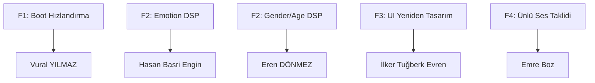

# 🎯 OmniSpeech — Hoca Feedback Görev Dağılım Planı

> **Tarih:** 4 Mayıs 2026  
> **Feedback Kaynağı:** Ders hocası  
> **Ekip:** Vural YILMAZ · Eren DÖNMEZ · Hasan Basri Engin · Emre Boz · İlker Tuğberk Evren

---

## 📋 Feedback Özeti

| # | Problem | Öncelik |
|---|---------|---------|
| F1 | Boot/splash ekranı çok uzun sürüyor | Yüksek |
| F2 | Ses dönüşümleri kötü — seçilen duygu yansımıyor, kütüphaneler optimize değil | Kritik |
| F3 | UI çok yapay zeka çıktısı gibi görünüyor, iyileştirilmeli | Yüksek |
| F4 | Ünlü kişilerin sesini taklit edebilme (örn. Michael Jackson) | Yeni Özellik |

---

## 🧑‍💻 Görev Dağılımı (Çakışmasız)

### Temel Kural: Her Kişinin Dokunduğu Dosyalar Ayrı



---

## 👤 Kişi 1: Vural YILMAZ — Boot Hızlandırma + Backend Startup

**Görev:** F1 — Boot ekranı süresini düşür, backend başlatmayı optimize et

**Dokunacağı Dosyalar:**
| Dosya | İşlem |
|-------|-------|
| `src-tauri/src/backend.rs` | Değişiklik |
| `src-tauri/src/main.rs` | Değişiklik |
| `backend/server.py` | Değişiklik |
| `backend/config.py` | Değişiklik |
| `run_omnispeech.bat` | Değişiklik |

**Yapılacaklar:**

1. **Backend health polling hızlandırma** (`backend.rs`)
   - `wait_for_health()` fonksiyonunda 40×250ms = 10sn timeout var → 20×150ms = 3sn'ye düşür
   - İlk birkaç deneme daha sık (50ms), sonra artan aralıkla polling yap

2. **Lazy import stratejisi** (`server.py`)
   - `torch`, `librosa` gibi ağır kütüphaneleri startup'ta değil, ilk kullanımda import et
   - FastAPI `lifespan` event'inde sadece health endpoint'i hemen açılsın
   - Pipeline nesnesini background thread'de oluştur

3. **Splash screen kaldırma/kısaltma** (`main.rs`)
   - `on_page_load` → hemen `window.show()` çağrılıyor ama backend bekleniyor
   - UI'ı backend hazır olmadan göster, backend durumunu status bar'da göster

4. **Config caching** (`config.py`)
   - Tekrarlanan config okumalarını önbelleğe al

**Branch adı:** `fix/boot-speed`

---

## 👤 Kişi 2: Hasan Basri Engin — Emotion DSP Optimizasyonu

**Görev:** F2 (kısım 1) — Duygu dönüşüm kalitesini iyileştir, seçilen duygunun sese yansımasını sağla

**Dokunacağı Dosyalar:**
| Dosya | İşlem |
|-------|-------|
| `backend/modules/emotion.py` | Büyük değişiklik |
| `backend/audio/features.py` | Küçük ekleme |

**Yapılacaklar:**

1. **EMOTION_PROFILES yeniden kalibrasyonu** (`emotion.py`)
   - `sad` profili: Pitch shift daha agresif (-5.0), rate daha yavaş (0.78), vibrato eklenmeli
   - `angry` profili: Daha sert attack, daha yüksek harmonik distortion
   - `whisper` profili: Voiced→unvoiced oranı artırılmalı, nefes gürültüsü eklenmeli
   - `excited` profili: Pitch varyasyonu (jitter) artırılmalı
   - `calm` profili: Çok düz pitch konturu, az enerji değişimi

2. **PSOLA tabanlı pitch shifting** (`emotion.py`)
   - `librosa.effects.pitch_shift` yerine PSOLA implementasyonu yaz
   - Bu, formant yapısını koruyarak daha doğal ses verir
   - `_psola_pitch_shift()` yeni fonksiyon ekle

3. **Duyguya özgü formant manipülasyonu** (`emotion.py`)
   - Her duygu için formant frekansları (F1, F2, F3) kaydırması ekle
   - Örn: üzgün → F1 düşür, kızgın → F1 ve F2 yükselt

4. **Prosody modülasyonu iyileştirme** (`emotion.py`)
   - `_apply_prosody()` fonksiyonunu sinüs yerine gerçek konuşma prosodisi ile değiştir
   - Enerji zarfını duyguya göre yeniden şekillendir (monoton değil, dinamik)

5. **Pitch contour extraction iyileştirme** (`features.py`)
   - `extract_pitch_contour()` fonksiyonuna `frame_length` parametresi ekle (mevcut API korunur)

> [!IMPORTANT]
> `emotion.py` sadece Hasan tarafından değiştirilecek. Diğer modüllere (gender_age, speaker_clone, singing) dokunmayacak.

**Branch adı:** `fix/emotion-quality`

---

## 👤 Kişi 3: Eren DÖNMEZ — Gender/Age DSP + Filtering Optimizasyonu

**Görev:** F2 (kısım 2) — Cinsiyet/yaş dönüşüm kalitesini iyileştir, ortak filtering pipeline'ı optimize et

**Dokunacağı Dosyalar:**
| Dosya | İşlem |
|-------|-------|
| `backend/modules/gender_age.py` | Büyük değişiklik |
| `backend/audio/filtering.py` | Değişiklik |
| `backend/audio/io.py` | Küçük iyileştirme |

**Yapılacaklar:**

1. **CONVERSION_PRESETS yeniden kalibrasyonu** (`gender_age.py`)
   - `male_to_female`: Formant ratio ve pitch daha rafine (pitch_shift: 4.5, warp: 1.20)
   - `female_to_male`: Daha doğal erkek sesi (daha fazla chest resonance)
   - `adult_to_child`: Nazalizasyon eklenmeli
   - `adult_to_elderly`: Tremor miktarı artırılmalı, nefes daha belirgin

2. **SpectralWarp modeli iyileştirme** (`gender_age.py`)
   - Mevcut lineer interpolasyon yerine kübik interpolasyon kullan
   - Phase coherence koruması ekle

3. **Post-filter iyileştirme** (`filtering.py`)
   - `_speech_band_filter`: Bandpass aralığını genişlet (55Hz–10.5kHz)
   - `_declick`: Threshold'u adaptif yap (signal-dependent)
   - `_soft_limit`: Knee parametresi ekle (daha yumuşak compression)
   - De-essing filtresi ekle (yüksek frekanslı sibilant azaltma)

4. **Audio IO iyileştirme** (`io.py`)
   - `load_audio_mono()`: Çok kısa ses kontrolü ekle (< 0.3sn uyarı)
   - `normalize_audio()`: RMS bazlı normalizasyon seçeneği ekle

> [!IMPORTANT]
> Eren `gender_age.py`, `filtering.py`, `io.py` dosyalarına sahip. `emotion.py` ve `speaker_clone.py`'ye dokunmayacak.

**Branch adı:** `fix/gender-age-filtering`

---

## 👤 Kişi 4: İlker Tuğberk Evren — UI Yeniden Tasarım

**Görev:** F3 — UI'ı yapay zeka çıktısı görünümünden kurtarıp profesyonel, özgün bir tasarıma çevir

**Dokunacağı Dosyalar:**
| Dosya | İşlem |
|-------|-------|
| `src/App.tsx` | Büyük değişiklik (sadece JSX/render kısmı) |
| `src/index.css` | Büyük değişiklik |
| `src/components/*.tsx` | Değişiklik |
| `src/main.tsx` | Küçük değişiklik |
| `index.html` | Meta/font değişiklikleri |

**Yapılacaklar:**

1. **Renk paleti ve tipografi değişikliği** (`index.css`)
   - Monoton mor-teal gradyanı yerine daha özgün, sıcak palet
   - Önerilen: Koyu lacivert (#0A0E1A) + turuncu-altın accent (#E8A838) + cyan (#00D4AA)
   - Font: "Sora" kalabilir ama ağırlıklar ve boyutlar rafine edilmeli
   - Her yerde `// comment_style` başlık formatını kaldır → normal Türkçe başlıklar

2. **Layout yeniden yapılandırma** (`App.tsx` render kısmı)
   - 3 kolon grid'i koru ama sidebar'ı daha kompakt yap (220px → 200px)
   - Sağ panel'i daralt (280px → 260px)
   - Kart tasarımlarını düzleştir (aşırı glassmorphism kaldır)
   - Metrik kartları daha az "dashboard" görünümlü yap

3. **Bileşen stilleri** (`index.css` + `components/`)
   - `.module-btn`: Icon + text düzenini değiştir, emoji yerine SVG icon kullan
   - `.drop-zone`: Daha minimal, daha az "template" görünümlü
   - `.chip` ve `.selection-chip`: Daha organik kenar yuvarlaklığı
   - Slider'lara özel track rengi (duyguya göre değişen)
   - Log panelini daha kompakt yap

4. **Micro-animasyonlar** (`index.css`)
   - Modül geçişlerinde fade animasyonu
   - Convert butonuna pulse efekti
   - Waveform area hover efekti

5. **Türkçeleştirme** (`App.tsx`)
   - UI metinlerini Türkçeye çevir (başlıklar, butonlar, açıklamalar)

> [!WARNING]
> İlker sadece UI/render kodunu değiştirecek. `App.tsx`'deki iş mantığı fonksiyonlarına (runConvert, startLive, vb.) DOKUNMAYACAK. Backend çağrı yapısı aynı kalacak.

**Branch adı:** `fix/ui-redesign`

---

## 👤 Kişi 5: Emre Boz — Ünlü Ses Taklidi (Celebrity Voice)

**Görev:** F4 — Ünlü kişilerin sesini taklit edebilme özelliği ekle

**Dokunacağı Dosyalar (TAMAMEN YENİ):**
| Dosya | İşlem |
|-------|-------|
| `backend/modules/celebrity_voice.py` | **Yeni dosya** |
| `backend/api/schemas.py` | Ekleme (yeni request/response modeli) |
| `backend/api/routes.py` | Ekleme (yeni endpoint) |
| `backend/pipeline/processor.py` | Ekleme (yeni pipeline metodu) |
| `src-tauri/src/commands.rs` | Ekleme (yeni komut) |
| `src-tauri/src/main.rs` | Ekleme (yeni handler kayıt) |
| `src-tauri/src/types.rs` | Gerekirse ekleme |
| `src/lib/tauri.ts` | Ekleme (yeni API çağrısı) |

**Yapılacaklar:**

1. **Celebrity Voice modülü** (`backend/modules/celebrity_voice.py` — YENİ)
   - Ünlü ses profilleri tanımla (DSP parametreleri ile):
   ```python
   CELEBRITY_PROFILES = {
       "michael_jackson": {
           "pitch_shift": +4.2, "vibrato_rate": 5.8, "vibrato_depth": 0.6,
           "breathiness": 0.15, "formant_shift": 1.12, "brightness": 0.4
       },
       "morgan_freeman": {
           "pitch_shift": -3.5, "vibrato_rate": 0, "vibrato_depth": 0,
           "breathiness": 0.08, "formant_shift": 0.88, "brightness": -0.2
       },
       "adele": { ... },
       "james_earl_jones": { ... },
       "taylor_swift": { ... },
   }
   ```
   - `convert_celebrity()` fonksiyonu: pitch shift + formant warp + vibrato + tını ayarı
   - Mevcut `speaker_clone.py`'den `SpeakerStyleAdapter` modelini KULLLANMAYACAK (çakışma önleme)
   - Kendi bağımsız DSP pipeline'ını oluştursun

2. **API endpoint** (`schemas.py` + `routes.py`)
   - `CelebrityRequest(input_path, celebrity, output_path)` şeması
   - `POST /api/convert/celebrity` endpoint'i
   - **routes.py'ye sadece yeni endpoint eklenecek**, mevcut endpoint'ler değişmeyecek

3. **Pipeline entegrasyonu** (`processor.py`)
   - `convert_celebrity_file()` metodu ekle
   - `process_live_chunk()` içine `if task == "celebrity":` bloğu ekle
   - **Mevcut metodlara dokunmayacak**, sadece yeni metod + yeni if bloğu

4. **Tauri komut ekleme** (`commands.rs` + `main.rs`)
   - `convert_celebrity` komutu ekle
   - `main.rs`'ye handler kayıt satırı ekle

5. **Frontend API** (`src/lib/tauri.ts`)
   - `convertCelebrity()` fonksiyonu ekle

> [!NOTE]
> Emre'nin UI tarafında modül butonu eklemesi İlker ile koordine edilmeli. İlker UI'ı yaparken "Celebrity Voice" modülü için yer bırakacak. Emre sadece API/backend tarafını yapacak.

**Branch adı:** `feat/celebrity-voice`

---

## 🔀 Çakışma Matrisi

| Dosya | Vural | Hasan | Eren | İlker | Emre |
|-------|:-----:|:-----:|:----:|:-----:|:----:|
| `backend.rs` | ✏️ | | | | |
| `main.rs` (Tauri) | ✏️ | | | | ✏️* |
| `server.py` | ✏️ | | | | |
| `config.py` | ✏️ | | | | |
| `emotion.py` | | ✏️ | | | |
| `features.py` | | ✏️ | | | |
| `gender_age.py` | | | ✏️ | | |
| `filtering.py` | | | ✏️ | | |
| `io.py` | | | ✏️ | | |
| `App.tsx` | | | | ✏️ | |
| `index.css` | | | | ✏️ | |
| `components/` | | | | ✏️ | |
| `index.html` | | | | ✏️ | |
| `celebrity_voice.py` | | | | | ✏️ |
| `schemas.py` | | | | | ✏️ |
| `routes.py` | | | | | ✏️* |
| `processor.py` | | | | | ✏️* |
| `commands.rs` | | | | | ✏️* |
| `lib/tauri.ts` | | | | | ✏️ |

> **✏️\*** = Sadece **ekleme** (append), mevcut koda dokunmaz → merge conflict riski çok düşük

---

## 📅 Zaman Planı

| Gün | Vural | Hasan | Eren | İlker | Emre |
|-----|-------|-------|------|-------|------|
| 1 | Backend lazy import | Emotion profil araştırma | Gender preset kalibrasyonu | Renk paleti + tipografi | Celebrity profil tanımlama |
| 2 | Health polling hızlandırma | PSOLA implementasyonu | SpectralWarp iyileştirme | Layout refactor | celebrity_voice.py yazma |
| 3 | Splash kaldırma | Formant manipülasyonu | Post-filter iyileştirme | Bileşen stilleri | API endpoint + pipeline |
| 4 | Test + fine-tune | Prosody iyileştirme | Audio IO iyileştirme | Animasyonlar + Türkçe | Tauri komut + test |
| 5 | **Tüm branch'ler merge** — Entegrasyon testi — Son düzeltmeler |

---

## 🔗 Merge Stratejisi

1. **Sıralama:** Vural → Eren → Hasan → Emre → İlker
   - Vural'ın boot değişiklikleri temel altyapı, ilk merge edilmeli
   - Eren'in filtering değişiklikleri Hasan'ın emotion kodunu etkiler (post_filter ortak)
   - Emre'nin yeni dosyaları minimal conflict riski taşır
   - İlker en son merge eder (UI değişiklikleri büyük diff oluşturur)

2. **Her kişi kendi branch'inde çalışır**, `main`'e doğrudan push yok
3. **Merge öncesi** her kişi kendi testlerini çalıştırır:
   ```bash
   # Backend testleri
   python -m pytest tests/ -v
   
   # Frontend build kontrolü
   npm run build
   ```

---

## ⚠️ Koordinasyon Noktaları

| Konu | Koordine Olacak Kişiler | Açıklama |
|------|------------------------|----------|
| Celebrity modül butonu | Emre ↔ İlker | İlker UI'da "Celebrity" butonu için yer bırakacak, Emre type'ları tanımlayacak |
| Post-filter değişiklikleri | Eren ↔ Hasan | Eren filtering'i değiştirince Hasan'ın emotion çıktısı etkilenir, test edilmeli |
| `processor.py` | Emre (ekleme) | Emre sadece yeni metod ekleyecek, mevcut metod imzaları DEĞİŞMEYECEK |
| `routes.py` | Emre (ekleme) | Emre sadece yeni endpoint ekleyecek, mevcut route'lar DEĞİŞMEYECEK |
| Backend startup | Vural | Server.py lazy import sonrası tüm modüller çalıştığı doğrulanmalı |
